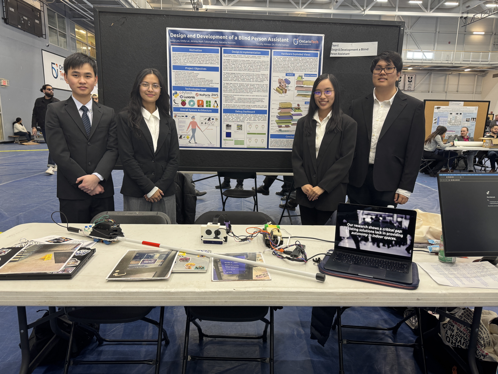
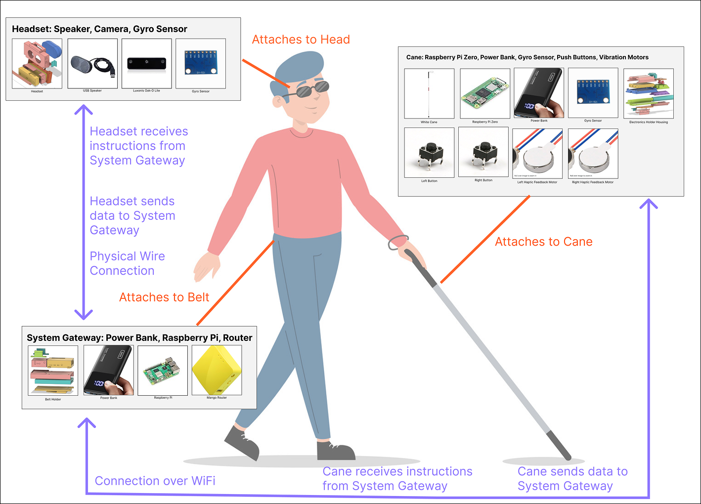
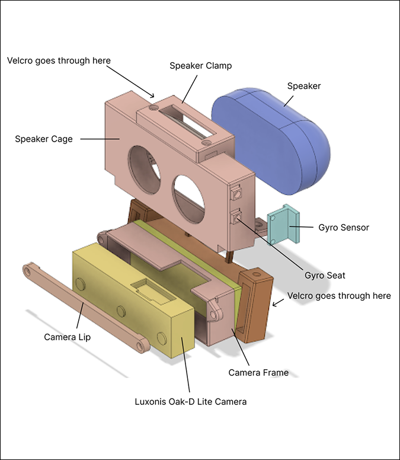
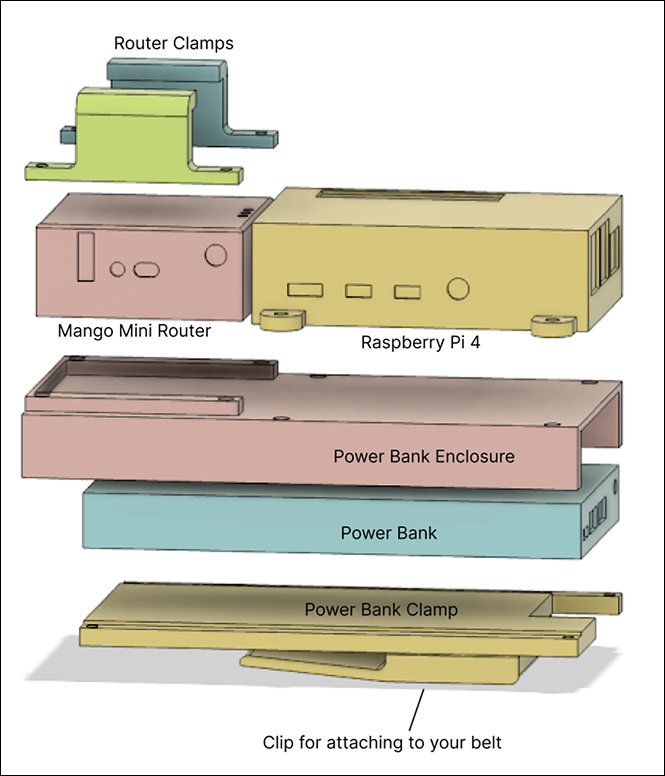
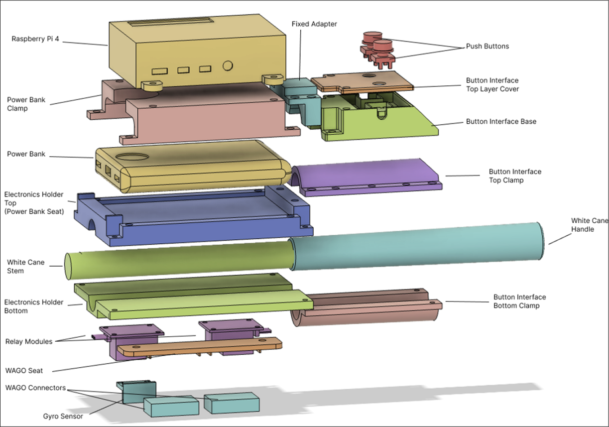

# blind_person_assistant

Design and Development of Blind Person Assistant

1st place Capstone Project within the Electrical and Software Engineering program at Ontario Tech University.

## Table of Contents

- [blind_person_assistant](#blind-person-assistant)
  - [Table of Contents](#table-of-contents)
  - [Team Members](#team-members)
  - [YouTube Video](#youtube-video)
  - [Capstone Poster](#capstone-poster)
  - [Directory Overview](#directory-overview)
  - [Overall System Architecture](#overall-system-architecture)
  - [Hardware Architecture](#hardware-architecture)
    - [Headset](#headset)
    - [Exploded System Gateway](#exploded-system-gateway)
    - [Exploded Smart Cane](#exploded-smart-cane)
  - [Software Architecture](#software-architecture)
    - [Headset](#headset-1)
    - [Smart Cane](#smart-cane)

## Team Members

Group 6:

- Andy Lau - 100754380
- Emily Lai - 100825007
- Jeremy Mark Tubongbanua - 100849092
- Natasha Naorem - 100845321

Capstone Supervisor: Dr. Khalid Hafeez

## YouTube Video

3 minute video showcasing the use cases and technical features of the project.

[](https://www.youtube.com/watch?v=-XyYb4GPD1U)

## Capstone Poster

This poster was printed and displayed at the exhibition on April 4, 2025.


Us at the exhibition:


## Directory Overview

```md
blind_person_assistant/
├── model_training/ - contains YOLOv8 Nano model training code
├── headset/ - contains headset code
├── smart_cane/ - contains smart cane code
├── stls/ - contains STL files for 3D printing
├── presentations/ - contains fall and winter presentation files
├── poster/ - contains capstone poster files
├── README.md
```

## Overall System Architecture



## Hardware Architecture

We built on top of a traditional white cane (a tool that most persons who are visually impaired are familiar with) and added a few sensors to it.

### Headset

| Item | Description |
|------|-------------|
| Luxonis Oak-D Lite Camera | 12 MP center camera with left+right stereo cameras for depth perception |
| USB Speaker | Powered and controlled by the Pi over USB 2.0 |
| Gyro Sensor | MPU6050 |



### Exploded System Gateway

| Item | Description |
|------|-------------|
| Raspberry Pi 5 | Main processing unit with 8 GB RAM, GPIO pins, and USB 3.0 ports |
| GLI Net Mango Router | Acts as access point for System Gateway Pi and Smart Cane Pi |
| Power Bank | Power delivery to the Raspberry Pi and Router |



### Exploded Smart Cane

| Item | Description |
|------|-------------|
| Raspberry Pi 4 | Main processing unit with 2 GB of RAM, GPIO pins |
| 2 Push Buttons | Connected to GND and GPIO pins |
| 2 Relay Modules | For controlling the vibration motors |
| 2 Vibration Motors | For haptic feedback |
| 2 WAGO Connectors | To act as the GND and 3.3V power rails |
| Power Bank | Power delivery to the Raspberry Pi |
| White Cane | Traditional white cane which acts as the base for the whole system |



## Software Architecture

### Headset

The headset code can be found in the `headset/` directory.

| Software Module | MQTT Topic(s) | API Endpoint(s) | Description |
|----------------|----------------|-----------------|-------------|
| new_camera |  1. `pi4/detections` for publishing JSON detections. 2. `pi4/depth_map` for publishing base64 depth map images for viewing purposes. 3. `pi4/detection_image` for publishing base64 detection images for viewing purposes | 1. `/video_stream` for raw live video stream. 2. `/detections` for running detections, with a comprehensive JSON reply of inference results. 3. `/` for fine tuned control of the camera | Main camera module for interfacing with the Luxonis Oak-D Lite Camera. Responsible for capturing video, calculating depth maps, running the YOLOv8 Nano model locally on the camera VPU, and outputting model inference results into MQTT topics. |
| camera_control | N/A | `/status`, `/start`, `/stop`, `/restart` | API control module for controlling the camera and getting its status. |
| speaker | N/A | 1. `/play_file` for playing preexisting audio files. 2. `/set_volume` for setting the volume of the speaker. 3. `/get_volume` for getting the volume of the speaker. 4. `/tts` for playing text-to-speech using espeak-ng lightweight TTS engine, with custom voice names, languages, and speeds. 5. `/stop` to stop audio playback. 6. `/card_info` for getting audio card information. | Audio module for interfacing with the USB speaker. Responsible for playing audio files, text-to-speech, and controlling the volume of the speaker. |
| gyro | `pi4/gyro` -> outputs raw gyro X, Y, Z, and acceleration X, Y, Z values | N/A | Stateless module for interfacing with the MPU6050 gyro sensor. Outputs raw gyro and acceleration values to the MQTT topic. |
| pitch_yaw_roll | `pi4/pitch_yaw_roll` -> outputs pitch, yaw, and roll values | 1. `/calibrate` -> runs gyro calibration sequence. 2. `/zero` zeroes the pitch, yaw, and roll values and takes the current orientation as the "zero" orientation | Stateless module for calculating the pitch, yaw, and roll of the headset using the raw gyro values. Outputs the calculated values to the MQTT topic. |
| vibration_motor_controller | `pi4/vibration_motor_controller` -> the mqtt topic that the smart cane will listen to, for vibration motor controller events sent by core | `/vibrate` -> specify left duration and right duration and the module will publish a message on controller mqtt topic. | Vibration motor controller module for controlling the vibration motors on the smart cane. Control the vibration motors using the endpoint, which publishes a message on the controller MQTT topic. |
| core | N/A | N/A | Core module for the headset. Responsible for subscribing to the MQTT topics and controlling the other modules. Runs 35 different menu options for the visually impaired user to inferace with |
| dashboard | N/A | N/A | Dashboard module for monitoring the entire system. For displaying the video stream, depth map, detection image, controlling speakers, controlling TTS engine, viewing Pitch/Yaw/Roll gauges, viewing raw sensor values and more. Mostly for exhibition purposes. |

### Smart Cane

The smart cane code can be found in the `smart_cane/` directory.

| Software Module | MQTT Topic(s) | API Endpoint(s) | Description |
|----------------|----------------|-----------------|-------------|
| buttons | `pi2/button_state` | N/A | Publishes the state of the push buttons to the MQTT topic. |
| gyro | `pi2/gyro` | N/A | Stateless module for interfacing with the MPU6050 gyro sensor. Outputs raw gyro and acceleration values to the MQTT topic. |
| pitch_yaw_roll | `pi2/pitch_yaw_roll` | 1. `/calibrate` -> runs gyro calibration sequence. 2. `/zero` zeroes the pitch, yaw, and roll values and takes the current orientation as the "zero" orientation | Stateless module for calculating the pitch, yaw, and roll of the smart cane using the raw gyro values. Outputs the calculated values to the MQTT topic. |
| vibration_motors | `pi2/vibration_motor_response` | N/A | Listens to system gateway vibration motor controller, outputs response to commands on MQTT topic. Each message is paired with a uuid4. |
